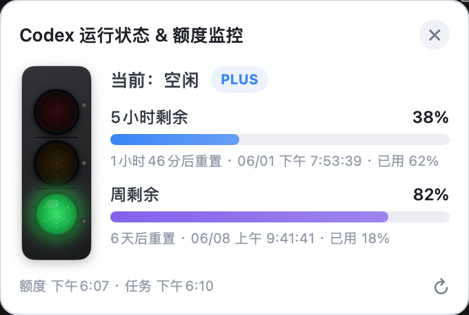

# codex_tip_for_mac codex红绿灯

macOS 原生菜单栏应用，用悬浮窗实时展示 **Codex 运行状态** 与 **ChatGPT 订阅额度**（5 小时 / 周窗口）。



## 功能

- **红绿灯状态指示** — 空闲（绿）/ 运行中（黄）/ 等待确认（红）
- **额度监控** — 展示 5 小时、周剩余百分比、重置时间与已用比例
- **订阅标识** — 显示当前计划类型（如 PLUS）
- **多任务列表** — 有活跃任务时展示任务名、状态与工作目录
- **菜单栏常驻** — 左键显示悬浮窗，右键打开菜单；支持快捷键
- **零额外登录** — 直接读取本机 Codex 登录态，无需单独配置 API Key
- **低频网络请求** — 额度默认 10 分钟刷新一次，降低频繁请求风险

## 环境要求

| 项目 | 要求 |
|------|------|
| 系统 | macOS 13 (Ventura) 或更高 |
| 工具链 | Xcode Command Line Tools / Swift 5.9+ |
| Codex | 已在 Codex Desktop 或 CLI 完成登录 |

登录成功后，本机应存在以下之一：

- `~/.codex/auth.json`
- `~/.config/codex/auth.json`
- macOS Keychain 中的 Codex 凭证（`cli_auth_credentials_store = keyring` 时）

可通过环境变量 `CODEX_HOME` 指定 Codex 数据目录。

## 快速开始

### 1. 克隆仓库

```bash
git clone https://github.com/zpzlxc/codex_tip_for_mac.git
cd codex_tip_for_mac
```

### 2. 打包为 .app

```bash
chmod +x build.sh
./build.sh
open dist/CodexHelper.app
```

构建产物位于 `dist/CodexHelper.app`。如需安装到应用程序文件夹：

```bash
cp -R dist/CodexHelper.app /Applications/
```

### 3. 开发调试（不打包）

```bash
swift run -c release
```

## 构建说明

`build.sh` 会依次执行：

1. `swift build -c release` — 编译 Release 二进制到 `.build/release/CodexHelper`
2. 组装 `dist/CodexHelper.app` 目录结构（`Contents/MacOS`、`Contents/Info.plist`）
3. 复制可执行文件与 `Resources/Info.plist`

手动构建等价命令：

```bash
swift build -c release
mkdir -p dist/CodexHelper.app/Contents/MacOS
cp .build/release/CodexHelper dist/CodexHelper.app/Contents/MacOS/
cp Resources/Info.plist dist/CodexHelper.app/Contents/
chmod +x dist/CodexHelper.app/Contents/MacOS/CodexHelper
open dist/CodexHelper.app
```

> **说明：** `dist/` 为本地构建输出，建议不要提交到 Git。克隆后自行执行 `./build.sh` 生成。

## 使用方式

启动后：

1. 菜单栏出现仪表盘图标（无 Dock 图标，属正常行为）
2. **左键** 图标 — 显示 / 聚焦悬浮窗
3. **右键** 图标 — 打开菜单

| 菜单项 | 快捷键 | 说明 |
|--------|--------|------|
| 显示悬浮窗 | ⌘W | 打开悬浮面板 |
| 刷新额度 | ⌘R | 手动刷新（最短间隔 2 分钟） |
| 设置… | ⌘, | 调整轮询间隔 |
| 退出 | ⌘Q | 退出应用 |

悬浮窗可拖动到任意位置；点击右上角 ✕ 也可退出。

### 设置项

- **额度刷新间隔** — 5～60 分钟，默认 10 分钟
- **任务扫描间隔** — 3～60 秒，默认 8 秒

## 工作原理

| 数据 | 来源 | 频率 |
|------|------|------|
| 5 小时 / 周额度 | `GET https://chatgpt.com/backend-api/wham/usage` | 默认 10 分钟 |
| 任务状态 | 本地 `~/.codex` 文件与 SQLite | 默认 8 秒 + 文件监听 |
| 登录态 | `auth.json` 或 Keychain | Token 临近过期时自动刷新 |

任务检测读取的本地数据包括：

- `process_manager/chat_processes.json`
- `sessions/**/*.jsonl`
- `state_5.sqlite` 中的 `agent_jobs`

## 项目结构

```
codex_tip_for_mac/
├── Sources/CodexHelper/       # Swift 源码
│   ├── Services/              # 认证、任务监控
│   ├── Views/                 # 悬浮窗 UI
│   └── Models/                # 数据模型
├── Resources/Info.plist       # App Bundle 配置
├── build.sh                   # 打包脚本
├── Package.swift              # Swift Package 定义
└── image.png                  # 应用截图
```

## 隐私与安全

- 本应用**不会**上传或收集你的凭证；Token 仅在本机读取与使用
- `~/.codex/auth.json` 等同于密码，请勿分享或提交到 Git
- 仓库中不含任何个人 Token 或 API Key

## 免责声明

本项目为**非官方**第三方工具，与 OpenAI 无关。使用 ChatGPT 后端接口可能受 OpenAI 服务条款约束，请自行评估风险。作者不对账号限制或其他后果负责。

## License

MIT（如需更换许可证，请自行添加 `LICENSE` 文件。）
